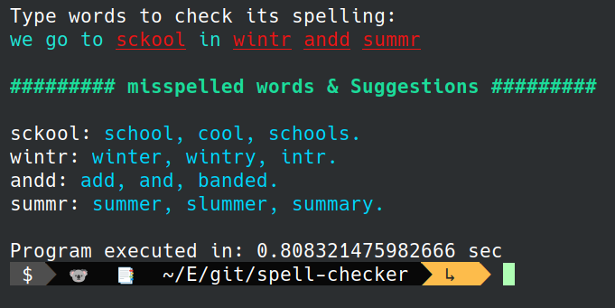

# Spell Checker:
>### This is a small project *- we had in college (level 2) -* in python that takes a sentence from the user and prints the same sentence with misspelled words underlined and top suggestions for those misspelled words if there are some in next lines.
# Example:
</img>
</img>